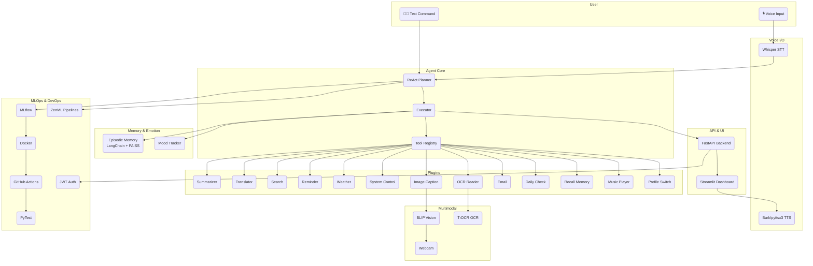

# 🤖 **JarvisOS**

The open-source, multimodal, emotionally intelligent, **agentic AI Operating System**.

A **Hugging Face–powered**, voice-enabled, plugin-based, autonomous agent OS — built by **Priyanshu Mishra** to rival the best. JarvisOS isn’t just an assistant — it’s your **personal co-pilot**: it listens, plans, reasons, acts, remembers, and evolves — all on your command.

---

## 🌟 **Project Vision**

JarvisOS isn’t just another chatbot — it’s a **benchmark** for open-source agentic AI. A modular, multimodal, **ReAct-style Autonomous AI OS** that:

* 🧠 **Thinks:** Plans tasks with a reasoning loop
* 🗂️ **Chooses Tools:** Selects plugins dynamically
* ⚡ **Acts:** Executes tasks autonomously
* 🧾 **Remembers:** Logs every goal, step, and outcome
* 💙 **Understands:** Tracks your mood, adapts, and responds

> **“I don’t build MVPs. I build benchmarks.” — Priyanshu Mishra**

---

## 🏛️ **JarvisOS System Architecture**

Below is a unique **Mermaid diagram** that maps **how JarvisOS works end to end** — from **voice input** to **agent planning**, **tool execution**, **memory storage**, and **user output** — all sandboxed with **MLOps & DevOps** built in.



---

## 🧩 **Core Capabilities**

| **Category**          | **Description**                                          |
| --------------------- | -------------------------------------------------------- |
| 🎙️ **Voice I/O**     | Whisper for speech-to-text, Bark/pyttsx3 for natural TTS |
| 🧠 **LLM Core**       | Hugging Face models — Flan-T5, Zephyr, Mistral           |
| 🧩 **Plugin Engine**  | Drop-in Python skills, registered as tools               |
| 🔥 **ReAct Planner**  | ReAct-style autonomous reasoning loop                    |
| 🗂️ **Tool Registry** | Dynamic callable tools                                   |
| 📚 **Memory Engine**  | Episodic & long-term memory (LangChain + FAISS)          |
| 💬 **Emotional AI**   | Daily mood logs, empathy-driven responses                |
| 🧪 **Tested System**  | PyTest for core + plugin + loop tests                    |
| 📊 **MLOps**          | MLflow for tracking, ZenML for pipelines                 |
| ⚙️ **DevOps Ready**   | Docker, GitHub Actions, secure JWT                       |
| 👁️ **Multimodal AI** | BLIP for vision, TrOCR for OCR                           |
| ☁️ **Deployable**     | FastAPI backend, Streamlit dashboard                     |
| 📱 **Mobile-Ready**   | REST API for mobile apps                                 |

---

## 🔌 **Sample Plugins**

| **Plugin**             | **Functionality**                 |
| ---------------------- | --------------------------------- |
| 📄 **Summarizer**      | Summarizes long text              |
| 🌐 **Translator**      | Translates text (Hindi ↔ English) |
| 🔍 **Search**          | Smart web search                  |
| ⏰ **Reminder**         | Voice-based reminders             |
| 🌦️ **Weather**        | Real-time weather info            |
| 🖥️ **System Control** | Open apps, control media          |
| 🔎 **OCR Reader**      | Extract text from images          |
| 🖼️ **Image Caption**  | Describe images                   |
| 📧 **Email**           | Read/send emails                  |
| 📆 **Daily Check**     | Mood check-in                     |
| 🧠 **Recall Memory**   | “What did I say yesterday?”       |
| 🎵 **Music Player**    | Mood-based music                  |
| 👤 **Profile Switch**  | Multi-user profiles               |

---

## 💙 **Emotional Intelligence Engine**

| **Feature**                  | **Description**               |
| ---------------------------- | ----------------------------- |
| 🗣️ **Daily Check-In**       | “How was your day?”           |
| 🧩 **Emotion Detection**     | Sentiment analysis            |
| 🧾 **Memory Recall**         | “What did I say about exams?” |
| 📊 **Mood Tracker**          | Trends & graphs               |
| 🎧 **Emotion-Based Actions** | Suggests music, breaks        |
| 🧘 **Reflection Mode**       | Weekly emotional summary      |

---

## ⚙️ **MLOps & DevOps**

| **Tool**              | **Purpose**                 |
| --------------------- | --------------------------- |
| 🔁 **MLflow**         | Model & plugin tracking     |
| ⚙️ **ZenML**          | Pipelines for fine-tuning   |
| 🐳 **Docker**         | Full containerization       |
| 🔐 **JWT Auth**       | Secure API access           |
| 🚀 **GitHub Actions** | CI/CD for tests + deploy    |
| 🧪 **PyTest**         | Agent loop & plugins tested |

---

## 🏗️ **Folder Structure**

```plaintext
JarvisOS/
├── main.py
├── core/
│   ├── memory/
│   ├── emotion/
│   ├── stt_tts/
│   ├── agent/
│   ├── tool_registry/
├── plugins/
├── mlops/
├── multimodal/
├── api/
├── dashboard/
├── config/
├── devops/
├── data/
├── tests/
└── docs/
```

---

## 💬 **Sample Interactions**

> **Me:** “Jarvis, research AI agents, summarize the findings, and email me tomorrow.”
> **JarvisOS:** “Goal accepted. I’ll research now, create a summary, and email it to you at 8 AM.”

> **Me:** “How was my mood this week?”
> **JarvisOS:** “Mostly positive, with a bit of anxiety on Wednesday due to your exams.”

> **Me:** “Continue the story from last week.”
> **JarvisOS:** “You left off at the Mandir with someone special… Shall we pick it up from there?”

> **Me:** “Plan my trip to Goa next weekend — flights, hotel, budget.”
> **JarvisOS:** “Got it. Searching flights, comparing prices, and shortlisting hotels now…”

---

## 🚀 **Deployment**

✅ Runs as a **FastAPI microservice**

✅ Voice + dashboard via **Streamlit**

✅ Fully **Dockerized & secured** with JWT

✅ Deployable on **Hugging Face Spaces**, Streamlit Cloud, or your own VM

✅ **CI/CD pipelines** with GitHub Actions

---

## 👑 **Author**

**Priyanshu Mishra — Building the benchmark, not the MVP.**

> “I don’t stop at *done* — I ship what others call *impossible*.”

---

## 📣 **Get Involved**

💡 **Clone it · Fork it · Build your own agent · Submit plugins · Star the repo → Join the revolution.**
JarvisOS — **Listen. Think. Act. Remember. Evolve.** 🔥

> 🔥 **The future is open-source, autonomous, and unignorable.**


